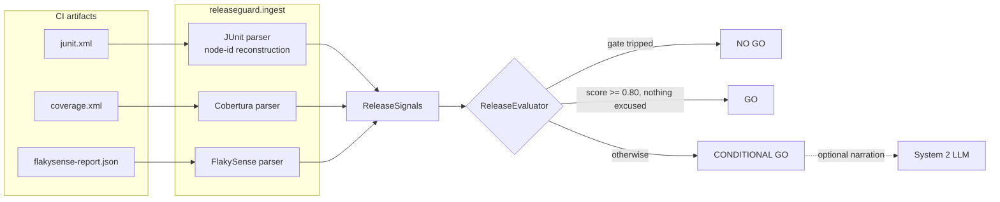

# ReleaseGuard

> Release-readiness agent — fuses test results, coverage, and flakiness signals into a single, explainable **go / no-go** recommendation.

> 🇫🇷 [Version française](README.md)

**Status: ✅ Complete.** Portfolio project P5 of a 6-project AI Test Engineering portfolio. 89 tests, zero API keys required, CI-gated by itself (see [Dogfooding](#dogfooding-this-repo-gates-itself)).

## The problem

Release managers aggregate quality signals by hand: a test report here, a coverage dashboard there, tribal knowledge about which failures are "the usual flaky ones". The synthesis lives in someone's head — unauditable, unrepeatable, and lost when that person is on leave.

ReleaseGuard turns that synthesis into a deterministic, explainable gate over standard CI artifacts: JUnit XML (tests), Cobertura XML (coverage), and a [FlakySense](https://github.com/BazanJeremy/flakysense) JSON report (flakiness).

```
$ releaseguard --junit junit.xml --coverage coverage.xml --flaky flakysense-report.json

ReleaseGuard verdict: CONDITIONAL GO (score 0.62)

Gates:
  [pass ] G1 real failure: no non-flaky failure
  [pass ] G2 coverage floor: line coverage 72% vs floor 60%

Signals:
  tests      1.00 (weight 0.50) 9/9 non-excused tests passed
  coverage   0.48 (weight 0.25) line coverage 72% on the 60%-85% ramp
  flakiness  0.00 (weight 0.25) 2 flaky of 10 executed tests

Conditions:
  - excused flaky failure: tests/test_search.py::test_search_pagination (source: flakysense)
  - weakest signal: flakiness at 0.00 (2 flaky of 10 executed tests)

Rationale (system1):
  No blocker; score 0.62 below GO threshold 0.80. [...]
```

Exit code `1` — a CI pipeline can gate on it directly (`0` GO, `1` CONDITIONAL GO, `2` NO GO, `3` error).

## The gate model (ADR-001)

**Hard gates first, weighted score second — never a pure average.** Averaging is the classic release-gate anti-pattern: excellent coverage can arithmetically mask a failing smoke test. A blocker must not be compensable.

| Layer | Rule |
|---|---|
| **G1** — real failure | ≥ 1 failing test *not* identified as flaky ⇒ `NO GO` |
| **G2** — coverage floor | line coverage < 60% ⇒ `NO GO` |
| **Score** (if no gate trips) | `0.50·tests + 0.25·coverage + 0.25·flakiness` — ≥ 0.80 ⇒ `GO`, else `CONDITIONAL GO` |

Three design commitments carry the model:

1. **The cross-signal rule.** A failing test that FlakySense lists as flaky does not trip G1 — the failure is *excused by name* in the conditions and caps the verdict at `CONDITIONAL GO`. No single parser can produce this decision; it exists only in the fusion. The join uses full pytest node ids reconstructed from JUnit attributes ([ADR-002](docs/adr/ADR-002-test-identity-join.md)); a join miss can only make the verdict stricter, never excuse a failure it should not — and the bare-name alternative was rejected precisely because a name collision fails toward false GO (verified counterfactual: [bug evidence #2](docs/bug-evidence.md)).
2. **`NO GO` requires an identifiable blocker.** The score alone can never veto: a low score without a named blocker is a conditional ship with listed risks, not a gut-feeling block.
3. **Hard verdicts never depend on an LLM.** System 2 (optional, env-gated) narrates `CONDITIONAL GO` rationales only; it can never alter the verdict, the score, or the conditions (pinned by tests). No `ANTHROPIC_API_KEY`, no problem: System 1 covers everything deterministically.

## Architecture



- Signals are optional by design (except tests): a missing coverage or flakiness report renormalizes the remaining weights and lands in the conditions list. Zero *executed* tests is an error, never a verdict — no evidence, no opinion.
- Every ADR-001 number lives in [`policy.py`](src/releaseguard/policy.py); nothing else may hard-code a threshold. Thresholds are per-run tunable via CLI flags; the *weights* are deliberately not — changing the weighting is a governance decision that goes through a superseding ADR, not a pipeline flag ([ADR-003](docs/adr/ADR-003-cli-contract.md)).

## Quickstart

```powershell
git clone https://github.com/BazanJeremy/ReleaseGuard.git
cd ReleaseGuard
python -m venv .venv
.\.venv\Scripts\Activate.ps1
pip install -e .[dev]
python -m pytest                # 89 tests, no API key needed

# try the three canonical scenarios (expected exits: 0, 2, 1)
releaseguard --junit data/samples/scenario_go/junit.xml --coverage data/samples/scenario_go/coverage.xml --flaky data/samples/scenario_go/flakysense-report.json
releaseguard --junit data/samples/scenario_no_go/junit.xml --coverage data/samples/scenario_no_go/coverage.xml --flaky data/samples/scenario_no_go/flakysense-report.json
releaseguard --junit data/samples/scenario_conditional/junit.xml --coverage data/samples/scenario_conditional/coverage.xml --flaky data/samples/scenario_conditional/flakysense-report.json
```

Optional System 2 narration: `pip install -e .[llm]` and set `ANTHROPIC_API_KEY`. Everything above works identically without it.

## Dogfooding: this repo gates itself

There is deliberately no Docker here (P4 already demonstrates container packaging). ReleaseGuard's deployment story is its own CI: every push runs the test suite with JUnit and coverage output, then runs **releaseguard on its own artifacts** and publishes the verdict in the job summary. The step passes on GO or CONDITIONAL GO and fails the pipeline on NO GO:

```bash
releaseguard --junit reports/junit.xml --coverage coverage.xml || test $? -le 1
```

See [.github/workflows/ci.yml](.github/workflows/ci.yml). The tool is not a demo beside the project — it is the project's own release gate.

## Architecture decisions

| ADR | Decision |
|---|---|
| [ADR-001](docs/adr/ADR-001-release-gate-model.md) | Release gate model: hard gates + weighted score, no pure averaging |
| [ADR-002](docs/adr/ADR-002-test-identity-join.md) | Test identity join: reconstructed pytest node ids, conservative on miss |
| [ADR-003](docs/adr/ADR-003-cli-contract.md) | CLI contract: verdict-mapped exit codes, ASCII output, threshold flags only |

Bugs caught by the project's own tests and demo runs are documented in [docs/bug-evidence.md](docs/bug-evidence.md) — including the first CI run catching untracked fixtures and the first dogfood run catching an output-encoding violation.

## Project structure

```
src/releaseguard/
  models.py        # Pydantic v2 signal + recommendation models
  policy.py        # every ADR-001 number, single source
  ingest/          # one parser per artifact dialect (JUnit, Cobertura, FlakySense)
  evaluator.py     # gates, weighted score, System 2 narration hook
  llm.py           # env-gated LLM client (Protocol + Anthropic reference impl)
  cli.py           # argparse CLI, verdict-mapped exit codes
data/samples/      # three canonical scenarios (GO / NO GO / CONDITIONAL)
docs/adr/          # architecture decision records
docs/bug-evidence.md
tests/             # 89 tests: contracts, parsers, gate rules, CLI, System 2
```

## Portfolio context

P5 of a 6-project AI Test Engineering portfolio. Its differentiator vs [FlakySense (P4)](https://github.com/BazanJeremy/flakysense) — sequential multi-agent orchestration on one stream — is **heterogeneous signal fusion and decision-making under gates**. The two interoperate without runtime coupling: a FlakySense report is just one input signal among others.

Not to be confused with [anomaly-sentinel](https://github.com/BazanJeremy/anomaly-sentinel), where the AI is the **system under test** (validating an LLM classifier as a critical component). Here the **delivery process** is the object: ReleaseGuard locks the decision to ship any build, and the AI decides nothing in it.

## Author

**Jérémy Bazan** — QA Engineer / QA Tech Lead, specialising in AI-driven Quality.
ISTQB Foundation v4. LLM integration (Claude, GPT) in production QA pipelines
within a major energy-sector group.

[LinkedIn](https://www.linkedin.com/in/jeremy-bazan/) · [GitHub](https://github.com/BazanJeremy)
